自訂台灣地區常用座標系統的轉換公式
==================================

-   在使用ArcGIS Desktop時，ArcToolbox當中提供使用者自訂座標系統轉換參數的工具："Create Custom 
    Geographic Transformation"。

    |image0|

-   透過該工具的使用，台灣地區的使用者可以自訂TWD67與TWD97投影座標系統的轉換參數。而設定完畢之後，
    定義為TWD67與TWD97投影座標系統的地理資料就可以使用這個設定檔來互轉。
   
-   設定畫面如下：

    |image1|

-   設定好的檔案，預設放在：C: \\ Documents and Settings \\ <user> \\ Application Data \\ ESRI \\ ArcToolbox \\ CustomTransformations 資料夾中，使用者可以自行複製到其他電腦使用。

-   其中，關於轉換方法（Method）的選擇，根據Help當中的說明，Coordinate Frame法與台灣地區常用的Bursa-Wolf法在程式引擎當中是一樣的，所以在設定時，可以選擇Coordinate Frame法。

    |image2|

-   而台灣地區常用的Bursa-Wolf法的參數，在史天元老師等人於測量工程第41卷第3期所發表的"TWD67與TWD97大地基準轉換方法研究"一文中，提到他們計算所得出的七參數Bursa-Wolf基準轉換參數，經過將旋轉量單位徑換算為秒後（因為Create Custom Geographic Transformation工具需要輸入秒），各參數如下：

+-----------------------------------+------------------------+------------------------------------------+
|     X Axis Translation (meters)   |     X軸平移量 (公尺)   |     730.160                              |
+===================================+========================+==========================================+
|     Y                             |     Y                  |     346.212                              |
+-----------------------------------+------------------------+------------------------------------------+
|     Z                             |     Z                  |     472.186                              |
+-----------------------------------+------------------------+------------------------------------------+
|     X Axis Rotation (seconds)     |     X軸旋轉量 (秒)     |     7.968009465325332199694565793688     |
+-----------------------------------+------------------------+------------------------------------------+
|     Y                             |     Y                  |     3.5498173155125282722429064796627    |
+-----------------------------------+------------------------+------------------------------------------+
|     Z                             |     Z                  |     0.40634166830677981965825251394163   |
+-----------------------------------+------------------------+------------------------------------------+
|     Scale Difference (ppm)        |     尺度參數           |     0.99998180                           |
+-----------------------------------+------------------------+------------------------------------------+

.. note::
    請注意，"TWD67與TWD97大地基準轉換方法研究"一文中，有提到經計算所得的七參數是有誤差的，
    因此轉換的結果也會有誤差。

-   設定完，按下"OK"，則定義檔會自動產生。

    |image3|

-  接下來，可以利用"Project"工具，進行資料的座標轉換。

    |image4|

-  接下來，在"Project"工具中，只要Input Coordinate System與Output Coordinate System
   互為TWD67與TWD97座標系統，就可以在"Geographic Transformation"的下拉選單中，選擇剛剛
   定義的轉換法。

    |image5|

-  按下"OK"，完成計算。

    |image6|

-  轉換出來的結果如下：

    |image7|

-  比例尺要放到很大，才會發現誤差。利用"Measure"工具量測，視地區不同，誤差約一公尺左右。

    |image8|

-  同樣透過該工具的使用，台灣地區的使用者可以自訂TWD97與WGS84地理座標系統（經緯度座標系統）
   的轉換參數。而設定完畢之後，定義為TWD97與WGS84地理座標系統的地理資料就可以使用這個設定檔
   來互轉。

-  設定畫面如下：
   
    |image9|

-  由EPSG 7.1版資料庫中查詢得知TWD97與WGS84的轉換方式：

    |image10|

-  TWD97與WGS84的轉換，名稱為"TWD97 to WGS84"，編號是"3830"，使用地區為"台灣，
   中華民國，近陸與近海，台灣島、澎湖（澎湖群島）島"，轉換精度為"1"公尺。
    
    |image11|

-  註記當中說明了"近似值有正負一公尺的水準，假設TWD97近似於WGS84的話"。資料來源
   為"OGP（International Association of Oil & Gas producers，國際油氣製造業協會）"。

    |image12|

-  座標轉換方法名稱"地理中心轉移"。轉換參數有三個，"X軸轉移為0"；"Y軸轉移為0"；
   "Z軸轉移為0"。並且，該轉換是可逆向轉換的。

    |image13|

-  所以，TWD97經緯度基本上等同於WGS84經緯度，因為X軸、Y軸、Z軸的平移皆為0。
  
-  設定完，按下"OK"，則定義檔會自動產生。

    |image14|

-  設定好的檔案，預設放在：C: \\ Documents and Settings \\ <user> \\
   Application Data \\ ESRI \\ ArcToolbox \\
   CustomTransformations資料夾中，使用者可以自行複製到其他電腦使用。

-  接下來，在"Project"工具中，只要Input Coordinate System與Output Coordinate
   System互為TWD97投影座標系統（或TWD97地理座標系統亦可）與WGS84地理座標系統，就可以
   在"Geographic Transformation"的下拉選單中，選擇剛剛定義的轉換法。

    |image15|
   
-  按下"OK"，完成計算。

    |image16|

-  如果有需要的話， 在"Project "工具中， 只要Input Coordinate System 與Output Coordinate 
   System 互為TWD67 投影座標系統（或TWD67 地理座標系統亦可） 與WGS84地理座標系統，可以
   在"GeographicTransformation"的下拉選單中，選擇剛剛定義的兩種轉換法同時套用，就可以互轉TWD67
   與WGS84座標系統。

    |image17|
   
-  按下"OK"，完成計算。

    |image18|

-  另外，當在使用ArcMap時，如果加入不同座標系統的地理資料，ArcMap一般會跳出警告訊息：

    |image19|

-  如果此時按下"Transformation"按鈕，也可以指定要使用的轉換參數：
   
    |image20|

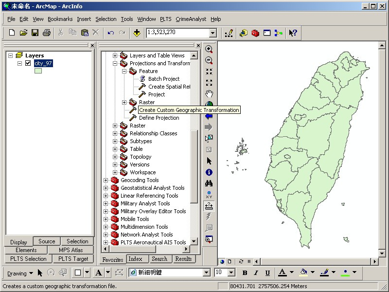
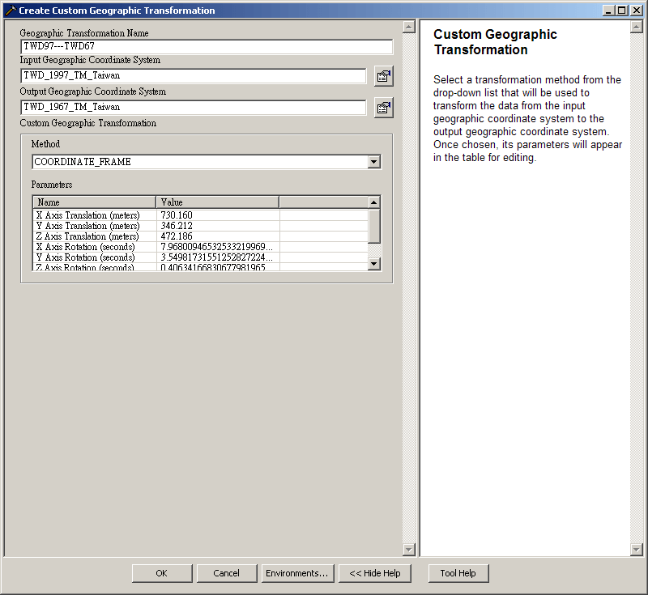
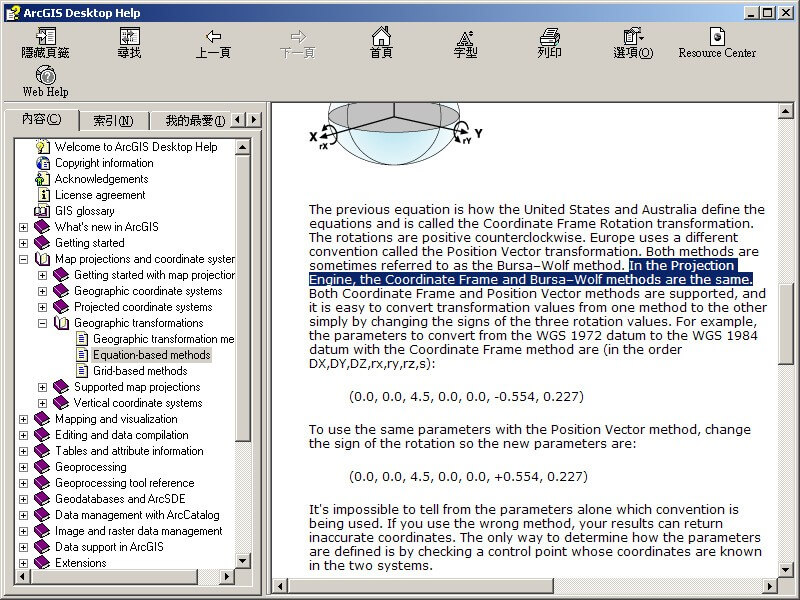
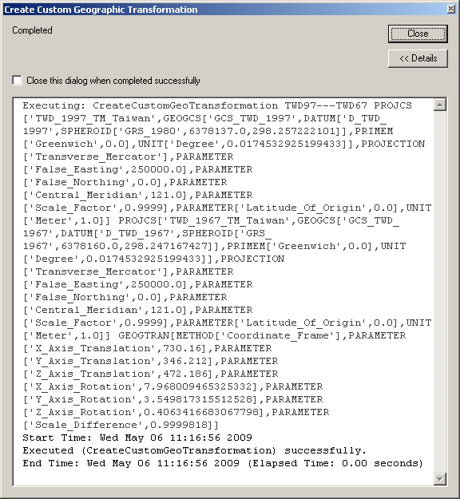
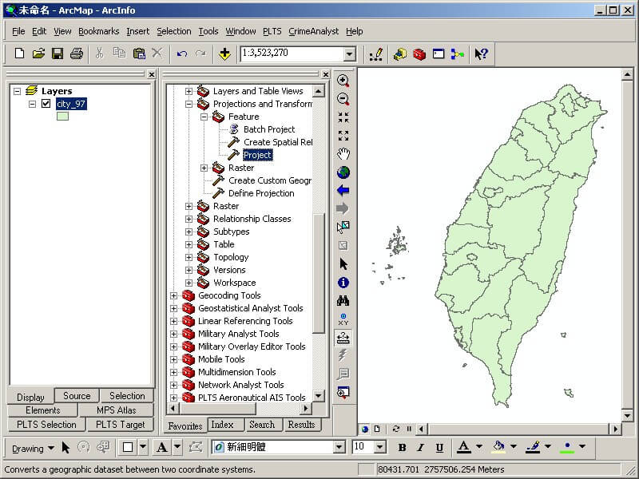
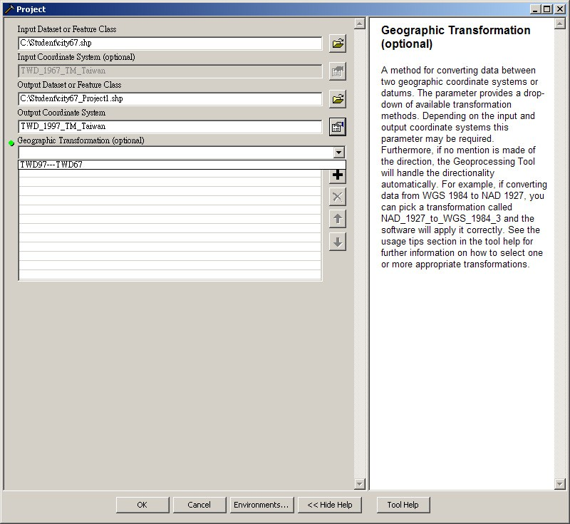
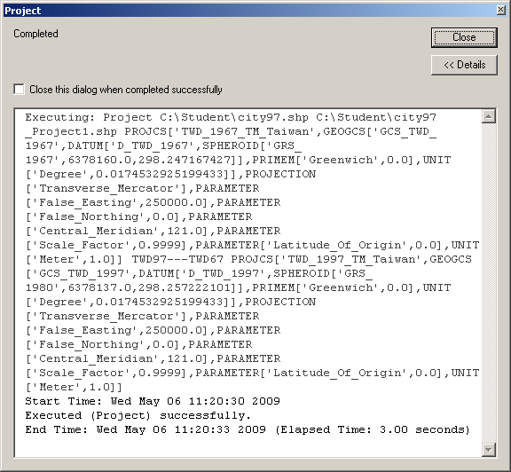
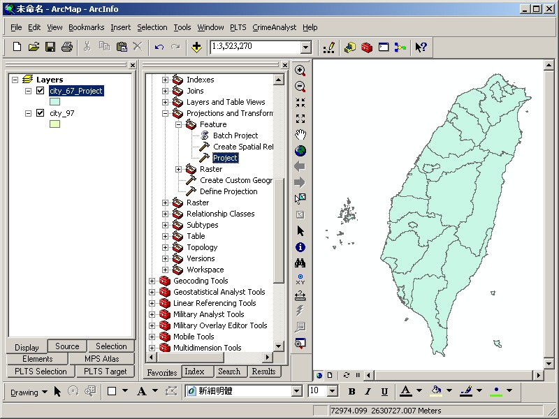
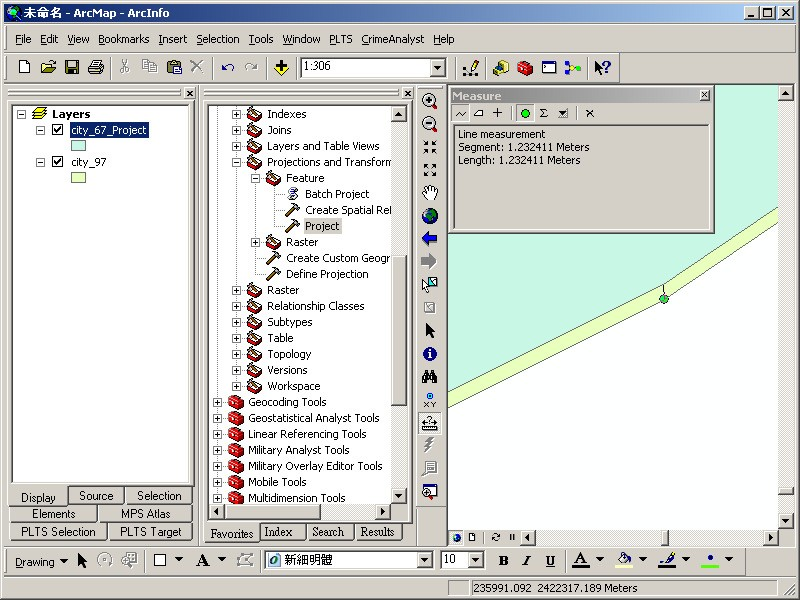
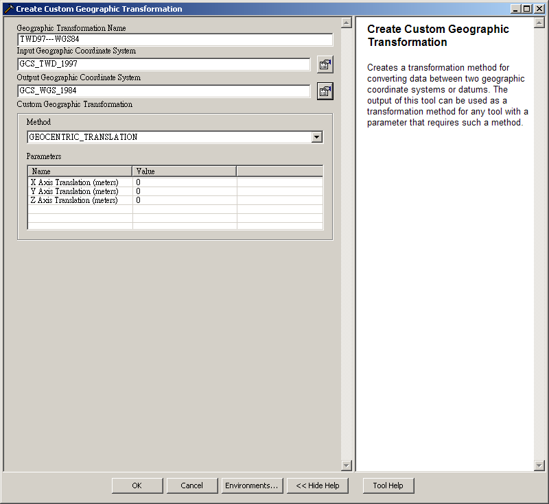
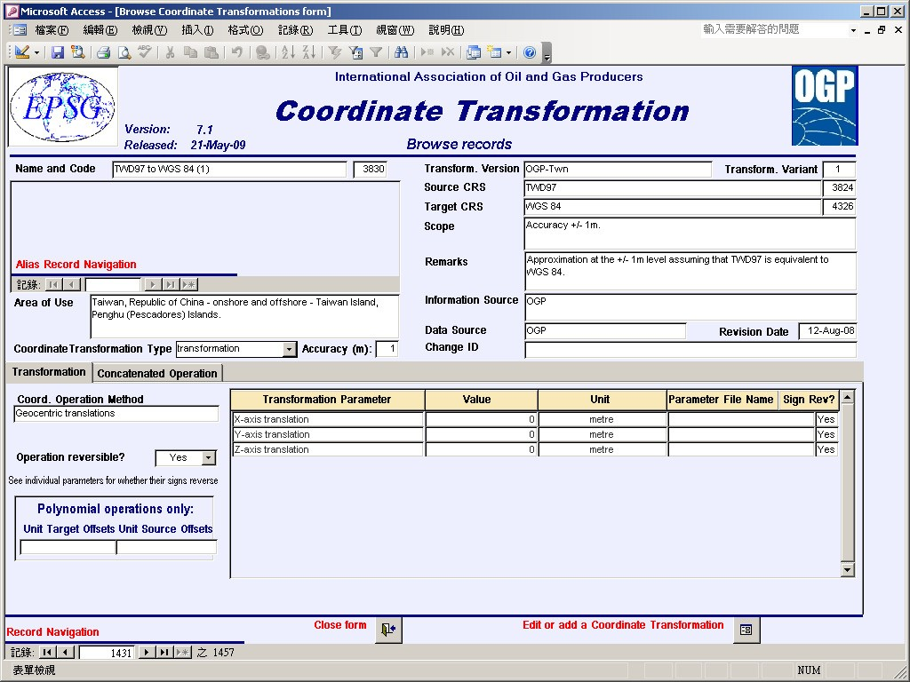
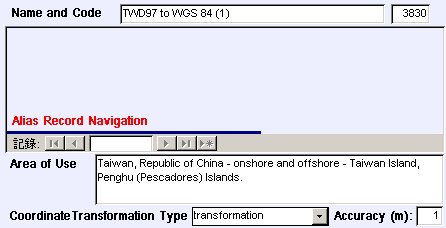
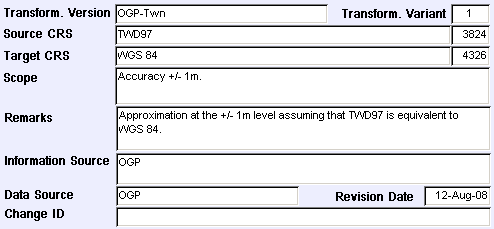
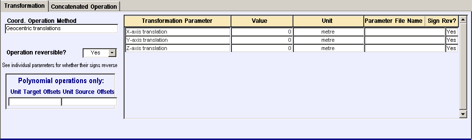
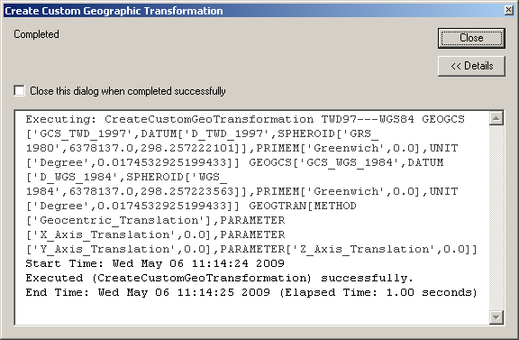

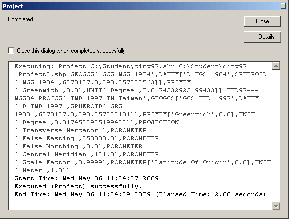
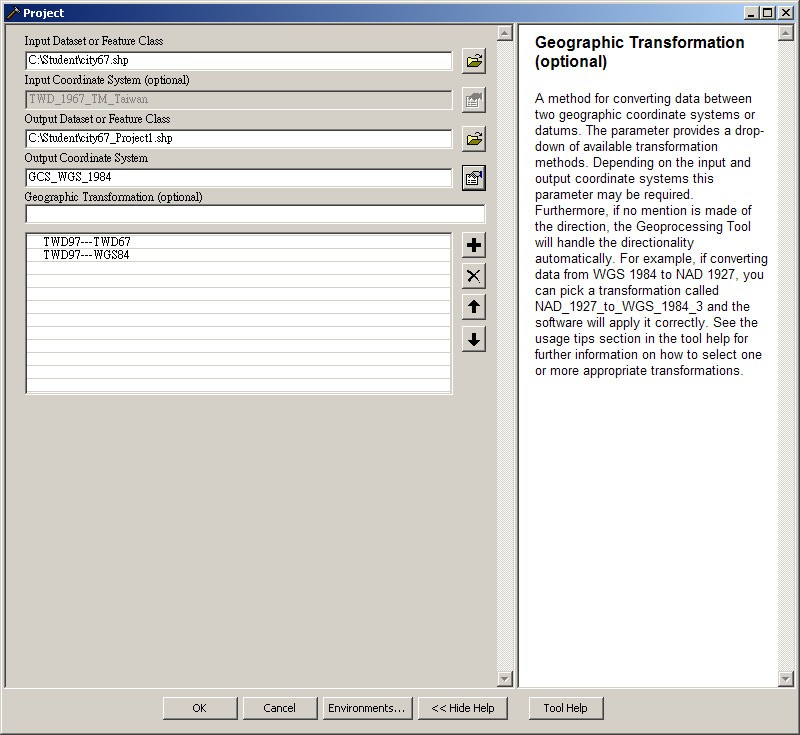
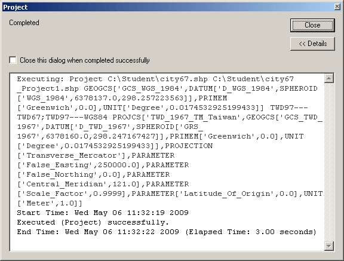
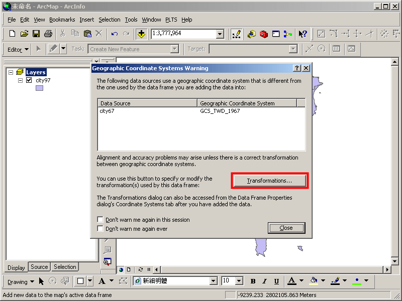
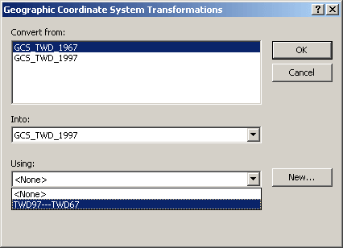