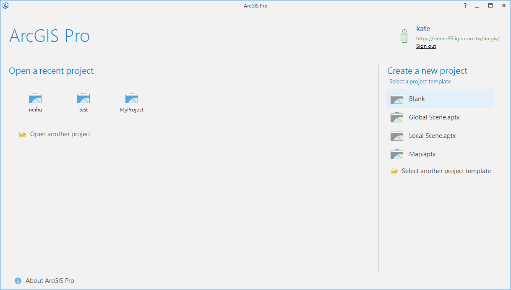
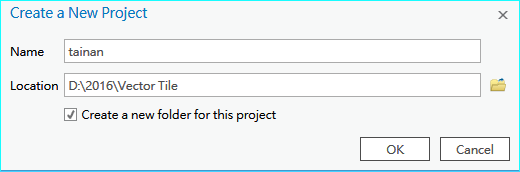
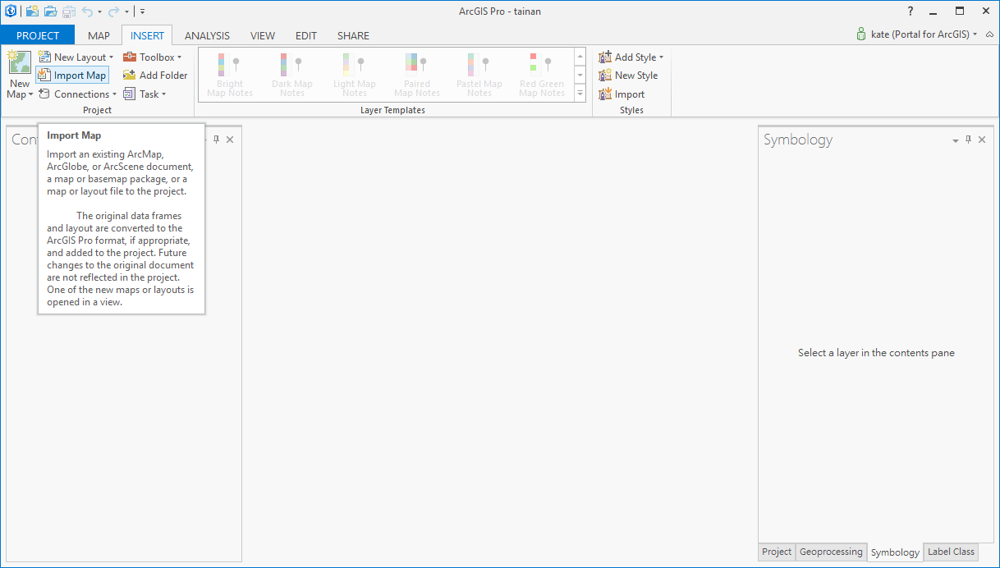
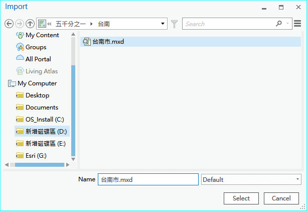
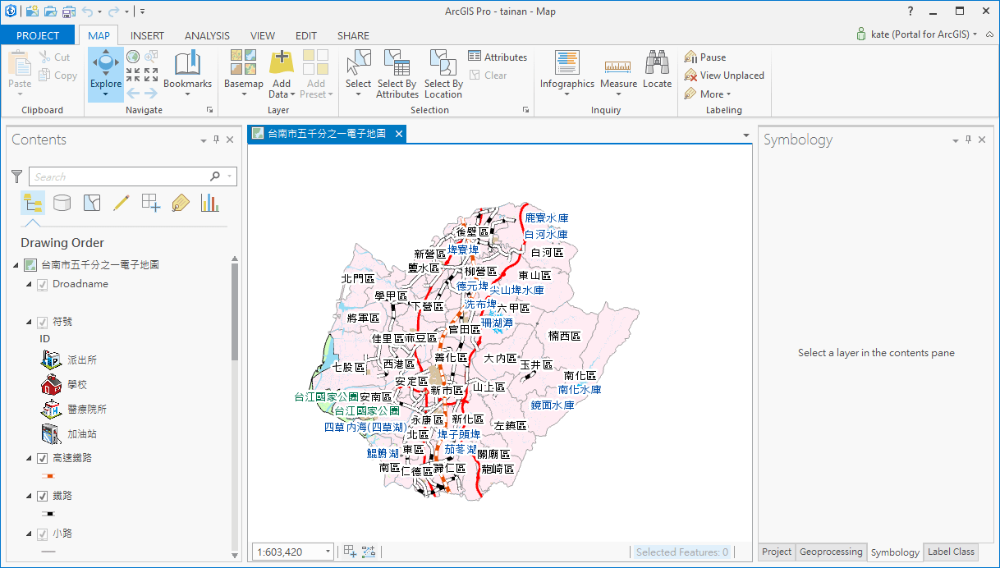
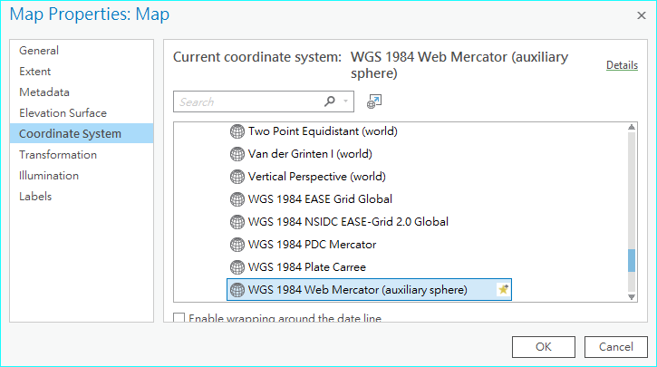
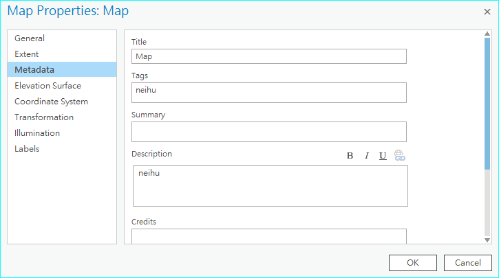
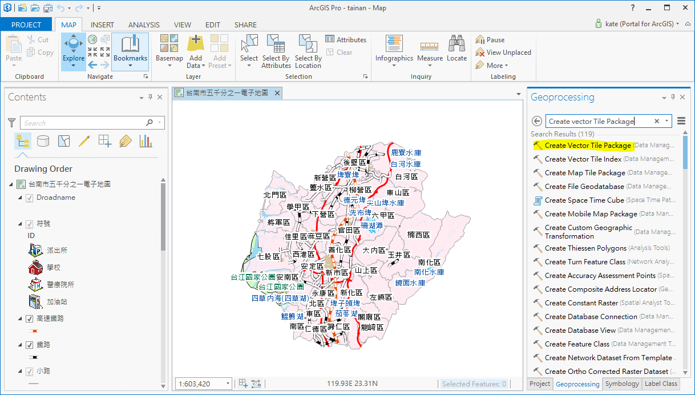
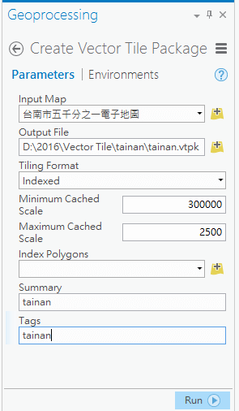

使用地圖文件製作向量圖磚
========================

匯入地圖文件(.mxd)檔
--------------------

1. 開啟ArcGIS Pro，點選右方的Create a new project項目中的Blank

|image0|

2. 輸入專案名稱以及專案儲存位置後，點擊OK

|image1|

3. 切換到INSERT分頁，點選import Map按鈕

|image2|

4. 找到您已經製作好的地圖文件(.mxd)後，點擊Select按鈕

|image3|

5. 地圖匯入至您的ArcGIS Pro中

    |image4|

製作向量圖磚
------------

1. 對圖框Map(台南市五千分之一電子地圖)按右鍵，點選Properties，再點選Coordinate
   System，將座標系統改為\ **WGS 1984 Web Mercator(auxiliary Sphere)**

|image5|

2. 左方點選MetaData頁籤，輸入相關描述資訊

|image6|

3. 點選右下方的Geoprocessing分頁，輸入\ **Create Vector Tile
   Package**\ ，點擊Create Vector Tile Package工具

|image7|

4. 設定相關參數後，點擊run執行製作向量圖磚封裝檔

|image8|
 
5. 向量圖磚製作完成

|image9|

.. |image9| image:: ./01_AuthorVectorTilePackageUsingMxd/image10.png
   :width: 5.76806in
   :height: 3.27708in
