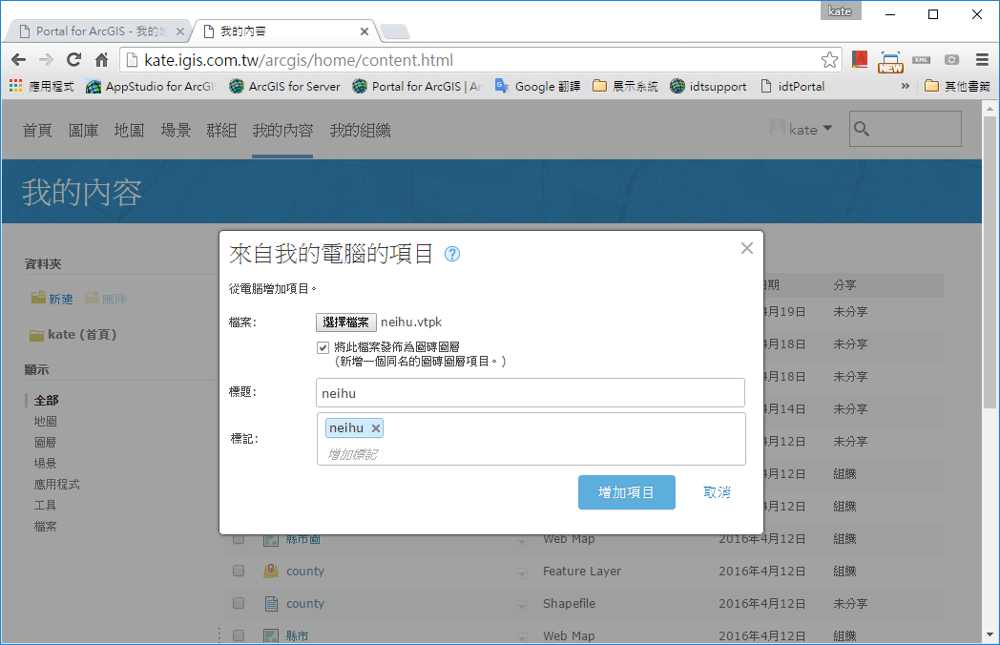
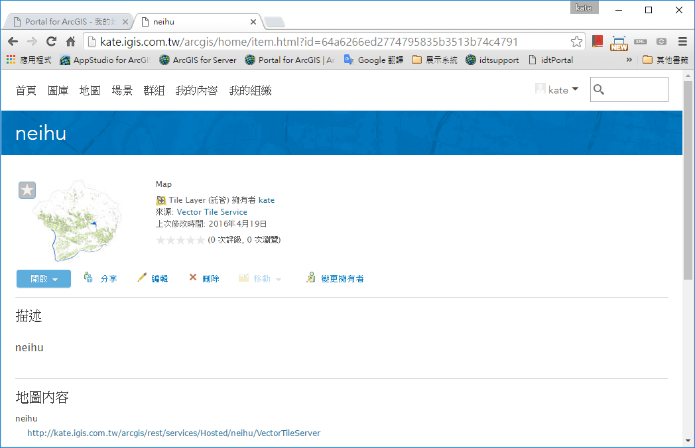
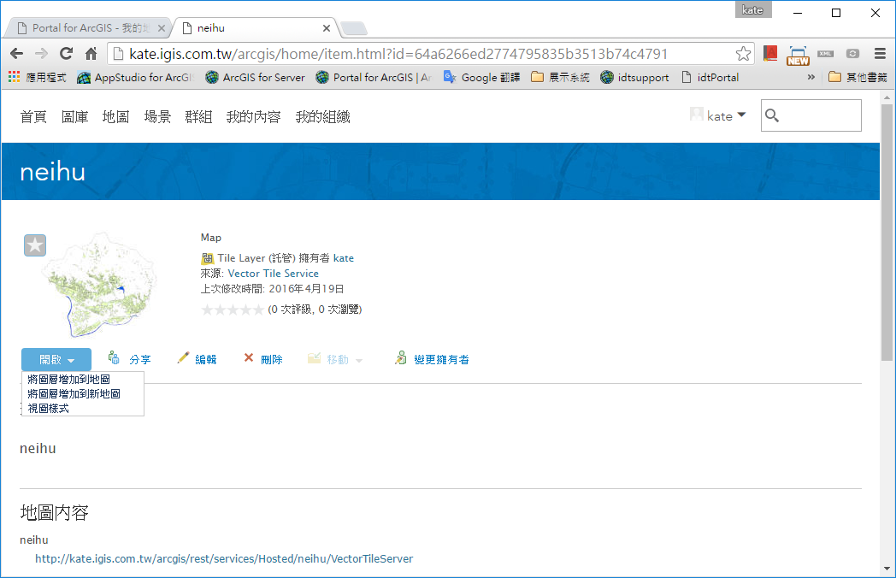
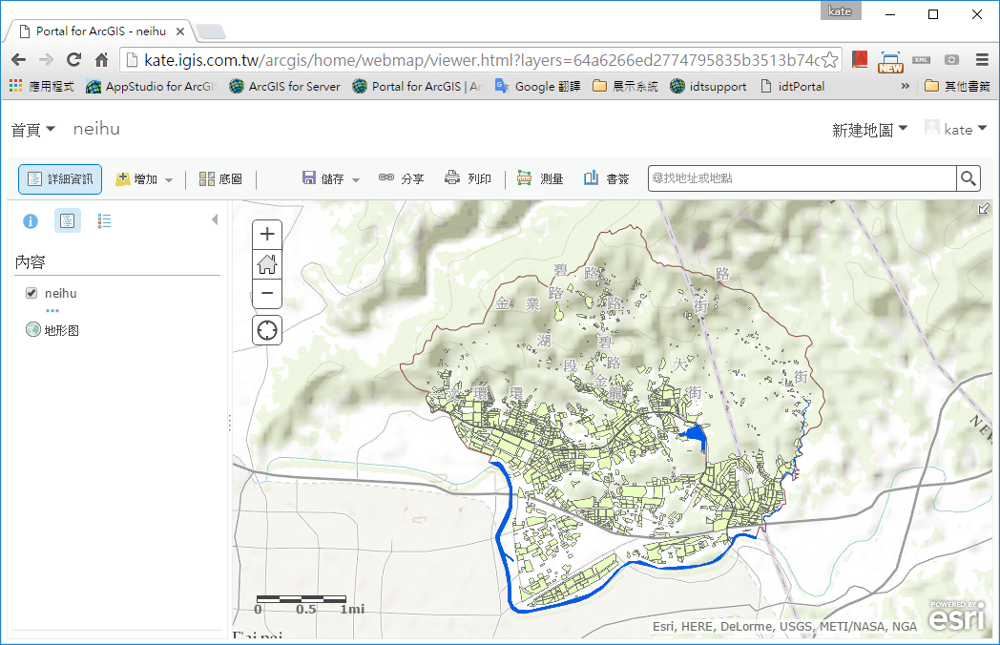
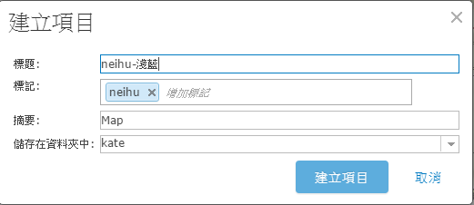
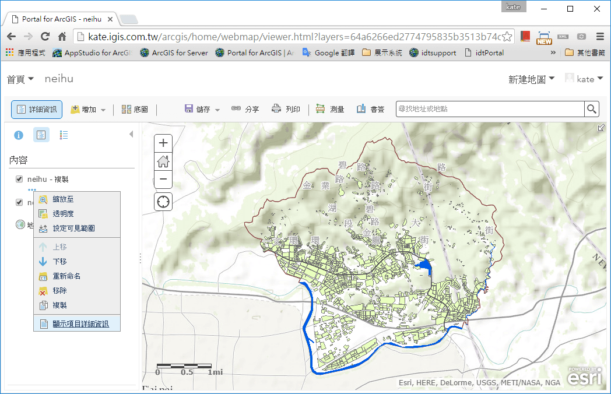
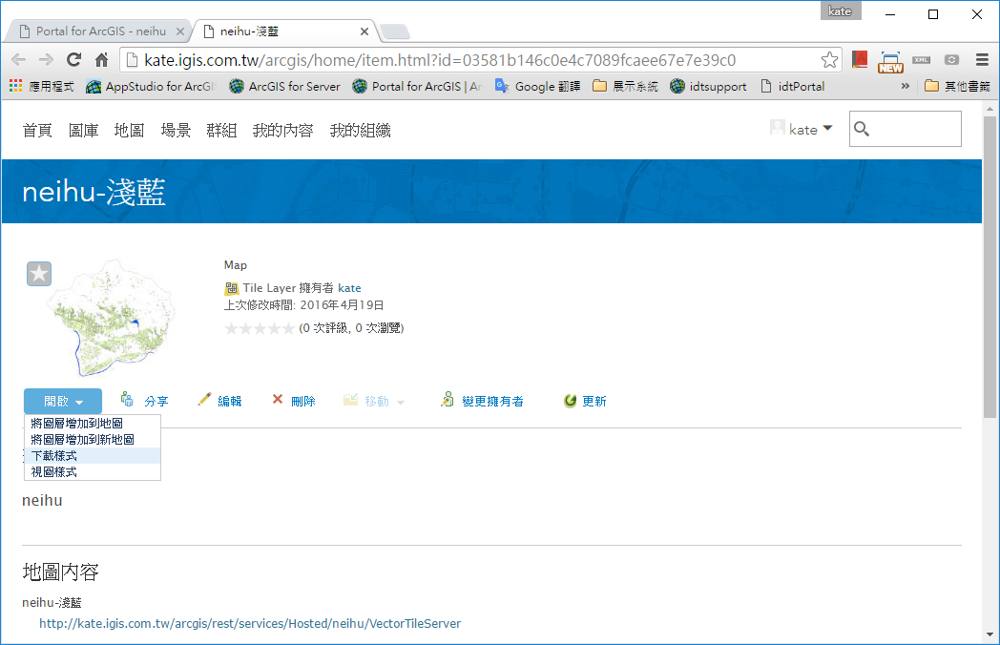
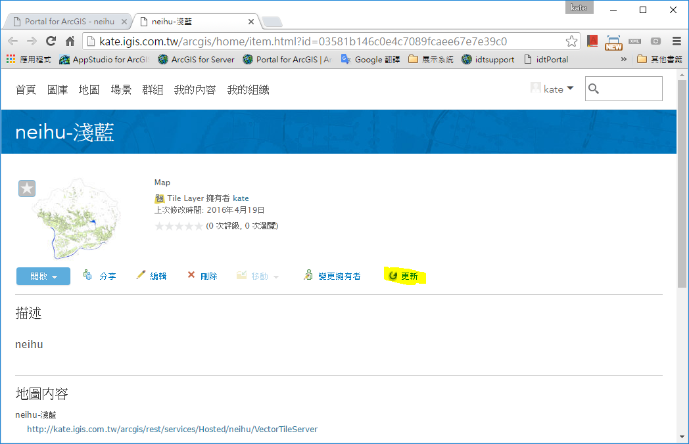
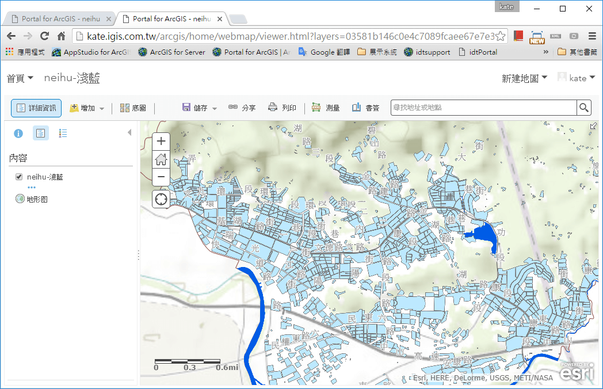

發佈向量圖磚並更改樣式符號
==========================

發佈向量圖磚服務
----------------

1. 上傳向量圖磚封裝檔(.vtpk)至Portal for ArcGIS 10.4 (或ArcGIS
   Online)上，同時發布成圖磚圖層。

    |image0|

2. 建立成功後可看見詳細資訊

    |image1|

3. 點選開啟按鈕可將此圖層加入地圖，或瀏覽視圖樣式

    |image2|

4. 選擇將圖層增加到地圖

    |image3|

5. 在您加入的圖層下方點選‧‧‧，選擇複製產生一個新的圖層

    |image4|

6. 將複製出來的圖層點選‧‧‧按鈕，選擇儲存圖層

    |image5|

7. 輸入相關資訊後，點選建立項目

    |image6|

8. 回到地圖同樣點選剛複製的圖層，點選‧‧‧按鈕，選擇顯示項目詳細資訊

    |image7|

修改向量圖磚樣式符號
--------------------

1. 點擊開啟按鈕，點選下載樣式

    |image8|

2. 下載後可用文字編輯器開啟，並修改

(此處範例將build圖層顏色從淺綠改為淺藍色)

    |image9|

3. 回到Portal for ArcGIS，找到您欲修改的Tile layer
   (也就是剛才下載樣式檔的那個圖層)，點選更新

    |image10|

4. 選擇您修改後的json檔案，點選更新項目

    |image11|

5. 點選開啟，將圖層增加到新地圖

    |image12|

6. 即可看見Build從淺綠色變成淺藍色了

    |image13|

.. |image4| image:: ./02_PublishVectorTile_modifySymbol/image5.png
   :width: 5.51181in
   :height: 3.55554in

.. |image9| image:: ./02_PublishVectorTile_modifySymbol/image10.png
   :width: 5.76806in
   :height: 4.00208in

