使用ArcGIS Pro 發佈製作好的3D模型
==================================

系統需求
--------

+---------------------+---------------------------------------------+--------------+
|     軟體名稱        |     需求檢核                                |     示意圖   |
+=====================+=============================================+==============+
| ArcGIS for Server   | -  License版本為Advanced                    | |image0|     |
|                     |                                             |              |
|                     | -  版本10.3.1以上                           |              |
|                     |                                             |              |
|                     | -  具備3D Analyst擴充模組                   |              |
+---------------------+---------------------------------------------+--------------+
| Portal for ArcGIS   | -  版本10.3.1以上                           | |image1|     |
|                     |                                             |              |
|                     | -  已為使用者帳號設定好ArcGIS Pro License   |              |
+---------------------+---------------------------------------------+--------------+
| ArcGIS Data Store   | -  版本10.3.1以上                           | |image2|     |
|                     |                                             |              |
|                     | -  已設為Managed Database                   |              |
+---------------------+---------------------------------------------+--------------+
| ArcGIS Pro          | -  版本1.1以上                              | |image3|     |
|                     |                                             |              |
|                     | -  已連到Portal for ArcGIS                  |              |
+---------------------+---------------------------------------------+--------------+

注意事項
--------

1. 3D模型檔案(如.kml、.3ds、.dae)一定要轉成Multipatch格式才能發佈

    -  模型檔案為.kml：使用KML To Layer工具轉換

    -  .shp或其他格式：使用Layer 3D To Feature Class工具轉換

2. Name、Item Description、Tags等詮釋資料，在ArcGIS
   Pro內設定時，必須全部使用英文。待服務發佈後，可至Portal上修改成中文。

操作步驟
--------

1. 啟動ArcGIS Pro 1.1 |image4|

2. 點選【\ **About ArcGIS Pro**\ 】

    |image5|

3. 先點選左側選單中的【Portals】，然後使用【滑鼠右鍵】點擊清單中的Portal連線。如果清單中沒有要連Portal連線，可在先點選左下角的【Add
   Portal】加入要連線的Portal網址。然後右鍵選單中點選【Sign
   In】，輸入Portal帳號密碼登入

    |image6|

4. 登入Portal後，點選左側【Licensing】，確認ArcGIS
   Pro版本授權，以及\ **3D Analyst擴充模組授權**

    |image7|

5. 點選左上角的\ |image8|\ 按鈕，返回ArcGIS Pro啟動頁面

6. 點選【Blank】開啟空白專案，設定專案名稱，並選擇新專案路徑，然後點選【OK】。\ **專案名稱與路徑請全部使用英文**\ ，以防發佈時發生錯誤。

    |image9|

7. 點選【Insert】切換工具選單，然後點選【New Map】，之後再從中選擇【New
   Scene】。

    |image10|

8. 點選INSERT選單中的Basemap切換底圖。只有Esri自行發佈的底圖，或是ArcGIS
   Server圖磚類型的底圖才能在Portal的Web Scene上顯示

    |image11|

9. 點選Analysis切換工具選單，然後點選Tools按鈕，在彈出的視窗中，輸入地理處理工具名稱，本例從KML檔案匯入3D模型，因此使用KML
   To Layer工具。然後點選工具名稱，啟動工具使用視窗

    |image12|

10. 輸入工具參數，點選Run執行工具，產生Multipatch圖層

    |image13|

11. 點選Share切換工具選單，然後點選Web Scene按鈕發佈Web Scene服務。

    |image14|

12. 在Share Web
   Scene中，輸入服務屬性內容，請全用英文輸入，然後點選Analyze進行分析。沒有錯誤的話，直接點選Share進行發佈

    |image15|

13. 發佈時可點選Jobs按鈕查看發佈情況，如下圖所示。

    |image16| |image17|

14. 在Portal中使用Web
   Scene開啟，可在Properties視窗中關閉地形起伏以便於瀏覽

    |image18|

    |image19|

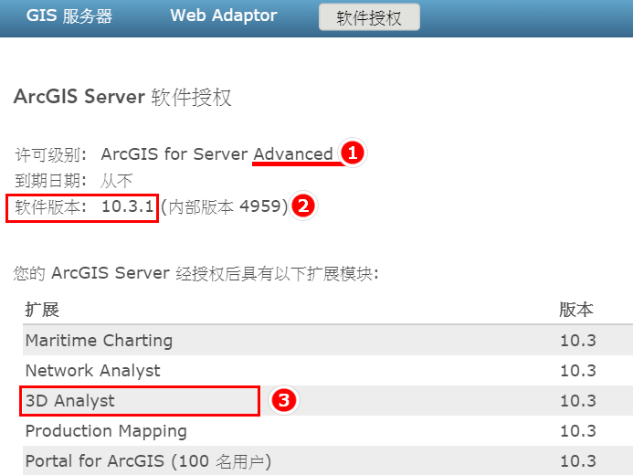
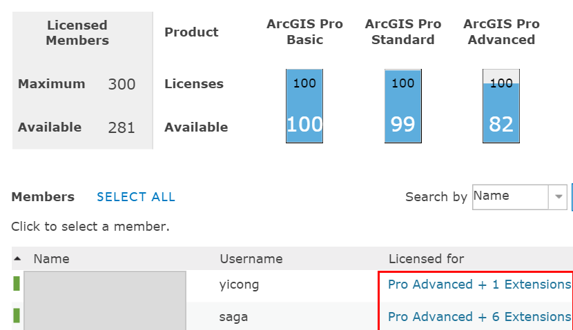
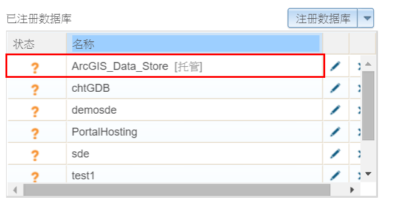
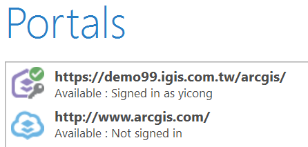
.. |image4| image:: ./03_publishExist3DModel/image5.png
   :width: 0.25591in
   :height: 0.23622in
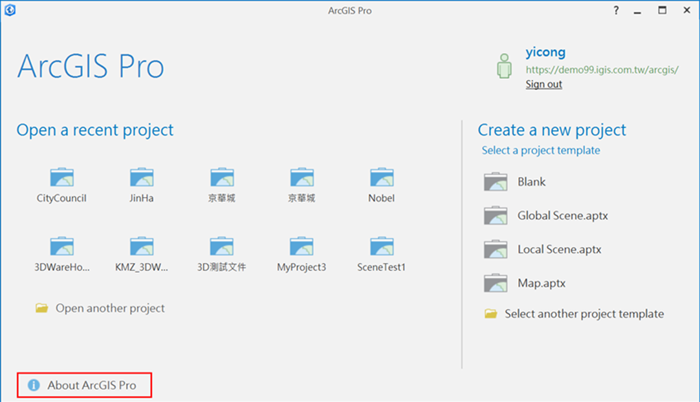
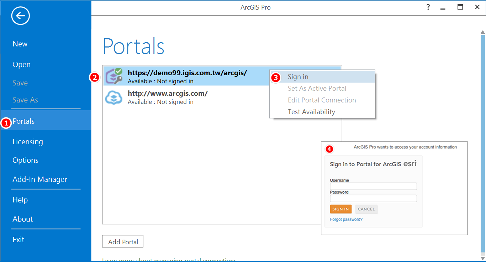
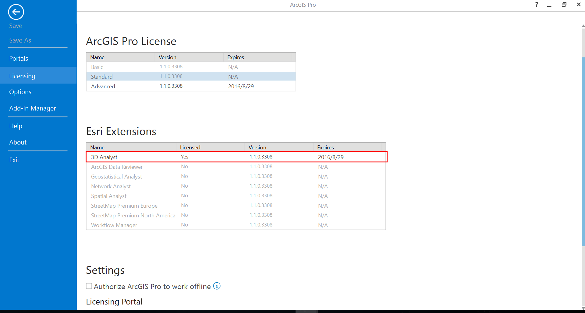

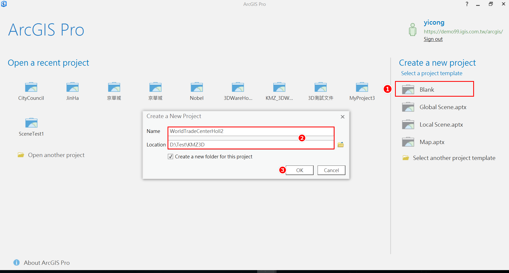
.. |image10| image:: ./03_publishExist3DModel/image11.png
   :width: 6.56479in
   :height: 3.28713in
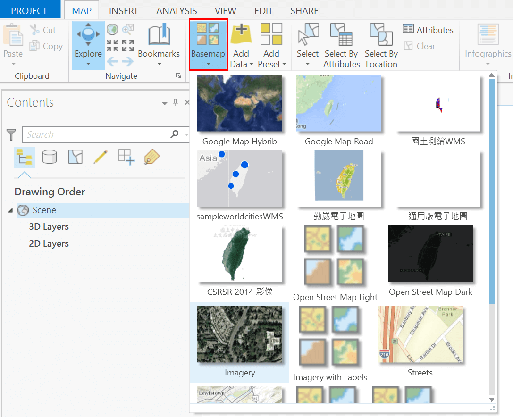
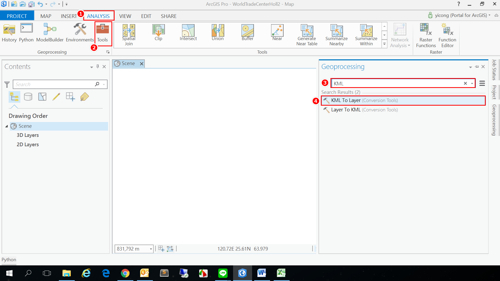
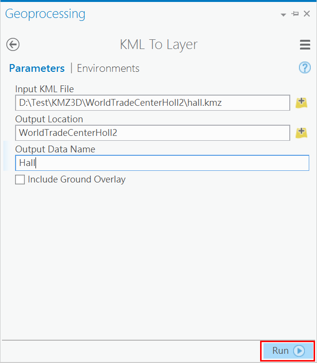
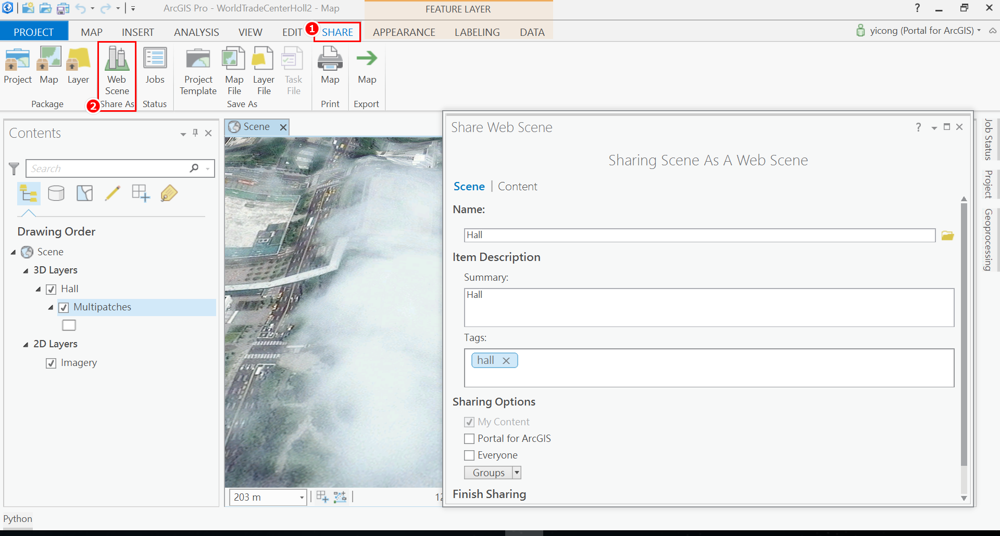
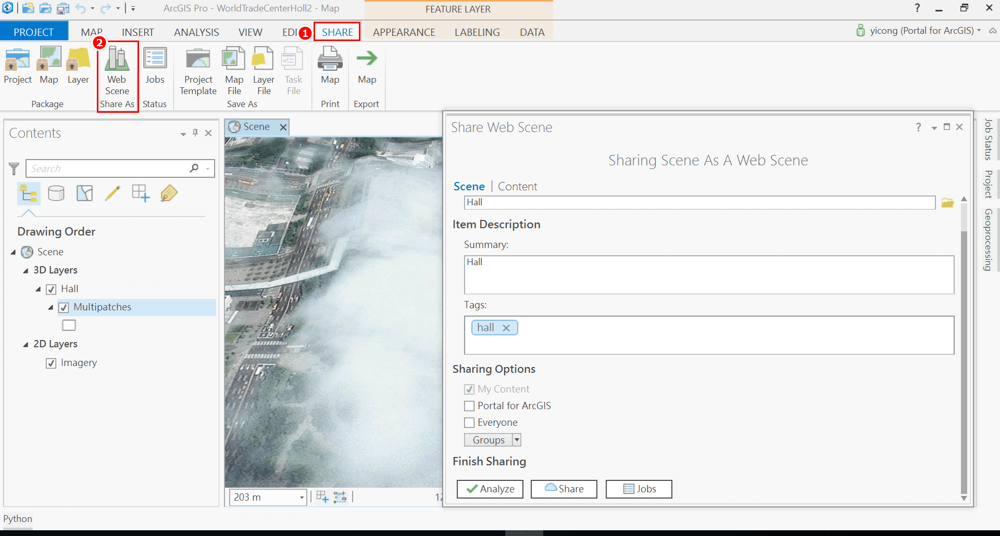
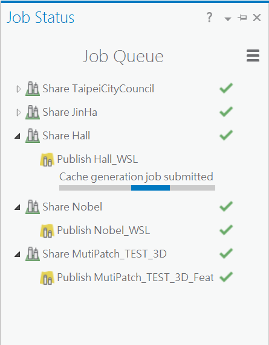
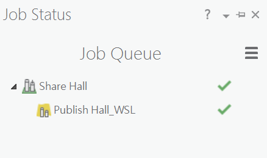
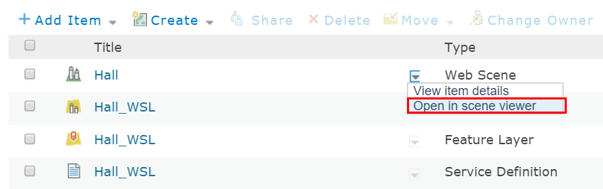
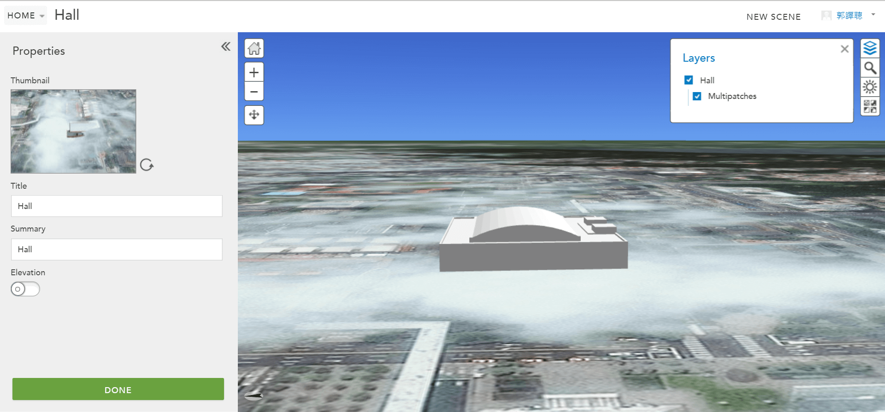
